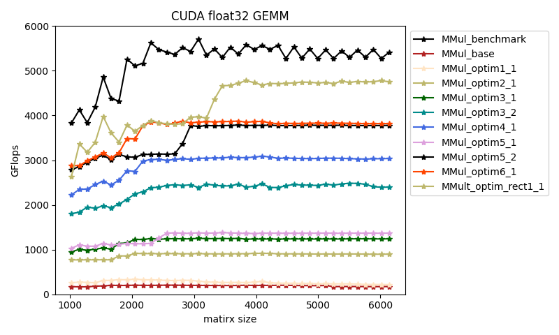

# cuda float3x86_float_gemm2 GEMM optimization Notes
> testing platform: Nvidia TITAN X

These articles/docs helped me a lot:
  - [CUDA C++ Programming Guide](https://docs.nvidia.com/cuda/cuda-c-programming-guide/index.html)
  - [Chinese: 知乎专栏-深入浅出GPU优化系列：GEMM优化（一）](https://zhuanlan.zhihu.com/p/435908830)
  - [Chinese: 知乎专栏-深入浅出GPU优化系列：GEMM优化（二）](https://zhuanlan.zhihu.com/p/442930482)
  - [Chinese: 知乎-CUDA 矩阵乘法终极优化指南](https://zhuanlan.zhihu.com/p/410278370)

This github repos helped me a lot:
  - [Cjkkkk/CUDA_gemm](https://github.com/Cjkkkk/CUDA_gemm)
  - [Liu-xiandong/How_to_optimize_in_GPU](https://github.com/Liu-xiandong/How_to_optimize_in_GPU/tree/master/sgemm)

Usage: `./exec.sh`

- **benchmark: cublas**. [MMult_benchmark](./src/MMult_benchmark.cu)
  - ~ 5400 GFlOPs

- **naive implementation**. [MMult_base](./src/MMult_base.cu)
  - very slow (~ 190 GFLOPs)
  - each thread calculates one element of C

- :rocket: **use register to accumulate Cvalue**. [MMult_optim1_x](./src/MMult_optim1.cu)
  - successful case(s): MMult_optim1_1
  - fairly boost (~ 250 GFLOPs)
  - How it works:
    - The temporary products are accumulated into a register and once done writes the result to global memory, Thus reducing global memory accesses.

- :rocket: **blocking into shared memory. (square blocks)** [MMult_optim2_x](./src/MMult_optim2.cu)
  - successful case(s): MMult_optim2_1
  - significant boost (based on MMult_base) (~ 900 GFLOPs)
  - How it works:
    - Shared memory is expected to be much faster than global memory. By dividing the C matrix into sub-blocks (to fit the device's resources) and moving the corresponding data into shared memory to compute, a lot of global memory accesses are saved.
    - Some helpful matierals: [Nvidia guide](https://docs.nvidia.com/cuda/cuda-c-programming-guide/index.html#shared-memory), [zhihu-article section `从global memory到shared memory`](https://zhuanlan.zhihu.com/p/435908830)

- :rocket: **increase the workload of each thread**. [MMult_optim3_x](./src/MMult_optim3.cu)
  - successful case(s): 
    - MMult_optim3_1 (each thread [load and compute] 1x4 elements)
    - MMult_optim3_2 (each thread [load and compute] 4x4 elements)

  - fairly/large performance boost
    - MMult_optim3_1 (~ 1250 GFLOPs)
    - MMult_optim3_4 (~ 2450 GFLOPs)

  - How it works:
    - As articles [1](https://cnugteren.github.io/tutorial/pages/page5.html), [2](https://zhuanlan.zhihu.com/p/410278370) say, the compute-to(-shared-)memory-access ratio is low (1/3) in the earlier versions, so the computation latency can not be well hidden, limiting the performance. According to my understanding, this trick is a kind of shared-memory-level blocking (as illustrated by `从shared memory到register` in this [article](https://zhuanlan.zhihu.com/p/435908830)). So the shared memory access can be reduced, increasing the compute-to(-shared-)memory-access ratio and boosting the performance.

- :rocket: **use CUDA vector types like float4**. [MMult_optim5_x](./src/MMult_optim4.cu)
  - successful case(s): 
    - MMult_optim5_1 (each thread load one float4 data and compute 4 elments)
    - MMult_optim5_2 (each thread load 4 float4 data and compute 16 elments)

  - fairly/large performance boost
    - MMult_optim5_1 (~ 1360 GFLOPs)
    - MMult_optim5_2 (~ 3780 GFLOPs)

  - How it works:
    - The GPU hardware provides load instructions for 32-bit, 64-bit, and 128-bit data, which maps to the float, float2, and float4 data types ..., in general, wider loads provide higher peak memory bandwidth.
    - Some helpful materials: [stack overflow](https://stackoverflow.com/questions/26676806/efficiency-of-cuda-vector-types-float2-float3-float4#comment41953443_26676806)

- :rocket: **use block of more flexible size (rectangle blocks)**. [MMult_optim_rect1](./src/MMult_optim_rect1.cu)
  - successful case(s): 
    - MMult_optim_rect1_1

  - big performance boost
    - MMult_optim5_1 (~ 4750 GFLOPs)

  - How it works:
    - With different block size configurations, we can get significantly different performance. Maybe there are some criteria to finetune the parameters, which is a future topic of this repo.

- **prefeteching**. [MMult_optim_rect2](./src/MMult_optim_rect2.cu)
  - Do not have performance boost currently
  - How it works:
    - In the case of matrix-multiplication, that means that we are going to load the next tile while we are computing the current tile, such that the latency of the loads can be hidden by computations.
    - Some helpful matierals: [blog](https://cnugteren.github.io/tutorial/pages/page11.html), [zhihu-section `数据的prefetch`](https://zhuanlan.zhihu.com/p/435908830)

