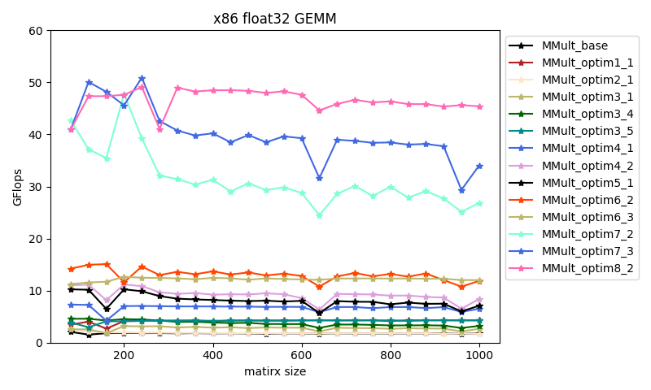
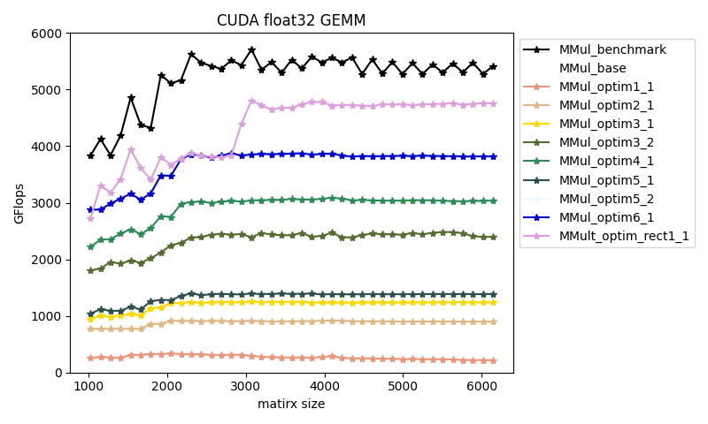

 # my_HPC_from_scratch

 This repo records my practices when learning High-Performance Computation (HPC). Currently, the following topics are elaborated:

 - x86
   - float32 GEMM optimization [link](./x86/x86_float_gemm/)

   - double GEMM optimization [link](./x86/x86_double_gemm/)

 - CUDA 
   - float32 GEMM optimization [link](./CUDA/cuda_float_gemm/)

 The following figures show the effects of optimizations, respectively.

    

 The following are some brief notes for the optimization tricks I take.

 ## x86 float32 GEMM optimization

 testing platform: 

 - **naive implementation**. [MMult_base](./x86/x86_float_gemm/src/MMult_base.c)
   - very slow (~ 1.7 GFLOPs)

 - **change loop order**. [MMult_optim1_x](./x86/x86_float_gemm/src/MMult_optim1.c)
   - successful case(s): MMult_optim1_1
   - big boost (~ 4.2 GFLOPs)
   - 🔑 How it works: better cache locality is achieved

 - **use registers to save frequently used data.** [MMult_optim2_x](./x86/x86_float_gemm/src/MMult_optim2.c)
   - successful case(s): MMult_optim2_1
   - slightly boost (based on MMult_base) (~ 1.8 GFLOPs)
   - How it works: registers are faster than memory to access

 - :rocket: **loop unrolling**. [MMult_optim3_x](./x86/x86_float_gemm/src/MMult_optim3.c)
   - successful case(s): 
     - MMult_optim3_1 (unroll by 1x4)
     - MMult_optim3_4 (unroll by 4x4)

     - MMult_optim3_5 (unroll by #pragma unroll)

   - reasonable performance boost
     - MMult_optim3_1 (~ 2.8 GFLOPs)
     - MMult_optim3_4 (~ 3.5 GFLOPs)

     - MMult_optim3_5 (~ 4.2 GFLOPs)

   - How it works:
     - loop unrolling reduces the cost of loop overhead, such as branching on the termination condition and updating counter variables. (However, excessive unrolling degrades performance)
     - Some helpful matierals: [ScienceDirect](https://www.sciencedirect.com/topics/computer-science/loop-unrolling)

 - :rocket: **utilize register again after unrolling**. [MMult_optim4_x](./x86/x86_float_gemm/src/MMult_optim4.c)
   - successful case(s): 
     - MMult_optim4_1 (unroll by 1x4 + register)
     - MMult_optim4_2 (unroll by 4x4 + register)

   - big performance boost
     - MMult_optim4_1 (~ 6.8 GFLOPs)
     - MMult_optim4_2 (~ 9.2 GFLOPs)

   - How it works:
     - the profit of using registers may be amplified after unrolling, compared with MMult_optim3_x.

 - **use pointers to reduce indexing overhead**. [MMult_optim5_x](./x86/x86_float_gemm/src/MMult_optim5.c)
   - even suffer from performance degradation in my test case
     - MMult_optim5_1 (~ 8.0 GFLOPs)

   - However, the later versions still optimize based on this version (because it seems that this trick is commonly supposed to be effective)
   - How it works (if it really can):
     - (I GUESS that) by using pointers, the calculation of indexes is simplified to be only addition, rather than both addition and multiplication. 

 - :rocket: **use SSE/AVX SIMD (Single Instruction Multiple Data)**. [MMult_optim6_x](./x86/x86_float_gemm/src/MMult_optim6.c) [MMult_optim7_x](./x86/x86_float_gemm/src/MMult_optim7.c)
   - Note: compiled with `-mfma` disabled.
   - successful case(s): 
     - MMult_optim6_2 (use SSE __m128)
     - MMult_optim7_2 (use AVX __m256)

   - big performance boost
     - MMult_optim6_2 (~ 12 GFLOPs)
     - MMult_optim7_2 (~ 30 GFLOPs)

   - How it works: 
     - SIMD is data-level parallelism, which enables processing multiple data with a single instruction. Requiring fewer instructions to process a given mass of data, SIMD operations yield higher efficiency than scalar operations.

     - Some helpful matierals: [Quora](https://qr.ae/pvFvMA), [zhihu(Chinese)](https://zhuanlan.zhihu.com/p/55327037), [CSDN blog(Chinese)](https://blog.csdn.net/qq_32916805/article/details/117637192), [blog](https://blog.triplez.cn/posts/avx-avx2-learning-notes/), [blog](https://chhzh123.github.io/summary/parallel-computing/#simd), 

 - :rocket: **use Fuse Multiply and Add (FMA) instruction**. [MMult_optim6_x](./x86/x86_float_gemm/src/MMult_optim6.c) [MMult_optim7_x](./x86/x86_float_gemm/src/MMult_optim7.c)
   - successful case(s): 
     - MMult_optim6_3 (use SSE __m128)

     - MMult_optim7_3 (use AVX __m256)

   - performance boost
     - MMult_optim6_3 (~ 12 GFLOPs)
     - MMult_optim7_3 (~ 38 GFLOPs)

   - How it works
     - FMA instruction set is an extension to the 128 and 256-bit Streaming SIMD Extensions instructions in the x86 microprocessor instruction set. While using FMA, A single instruction reads three operands, multiplies two operands and adds the third to the product, and writes the sum in the result operand. Hence, the two floating-point instructions (multiplication and addition) would be replaced by one, so the speed is increased. In addition, higher precision is achieved because only one rounding is applied when doing floating-point computation.
     - Some helpful materials: [doc](https://course.ccs.neu.edu/cs3650/ssl/TEXT-CD/Content/COD3e/InMoreDepth/IMD3-The-PowerPCs-Multiply-Add-Instruction.pdf), [Wikipedia](https://en.wikipedia.org/wiki/Multiply–accumulate_operation), [Quora](https://www.quora.com/How-does-Fused-Multiply-Add-FMA-work-and-what-is-its-importance-in-computing)

 - :rocket: **use cache blocking**. [MMult_optim8_x](./x86/x86_float_gemm/src/MMult_optim8.c)
   - successful case(s):
     - MMult_optim8_2

   - performance boost
     - performance boost for the large matrix is maintained

   - How it works: 
     - The memory access inside the small block can achieve high memory locality, enhancing the cache hit rate.
     - Some helpful materials: [TVM doc](https://tvm.apache.org/docs/how_to/optimize_operators/opt_gemm.html#blocking), [Stack overflow](https://stackoverflow.com/questions/63614160/how-does-cache-blocking-actually-speed-up-performance) 

 - **use packing.** [MMult_optim9_x](./x86/x86_float_gemm/src/MMult_optim9.c)
   - even suffer from performance degradation in my test case
     - MMult_optim9_1 (~ 8.5 GFLOPs) (based on MMult_optim6_3)

   - How it works (theoretically)
     - Packing refers to the rearranging of B elements to make them suitable to the way we access B in the inner compute kernel. 

     - I think that packing itself will cause extra overhead, leading to the performance drop in my experiments. In [FBGEMM source code](https://github.com/pytorch/FBGEMM/blob/9d7c48a65419d0350f9e9e72f31e05bfe37e85a4/src/PackBMatrix.cc#L14~L166), packing is applied to weights. Since weights are constant during inference,  it can be packed once and used multiple times, compensating the overhead of packing.
     - Some helpful materials: [blog](https://chhzh123.github.io/blogs/2020-03-20-tvm-gemm/#数组打包packing), [FBGEMM source code](https://github.com/pytorch/FBGEMM/blob/9d7c48a65419d0350f9e9e72f31e05bfe37e85a4/src/PackBMatrix.cc#L14~L166)

>  For HPC, I am still a (very) freshman. Any issues are welcomed!
